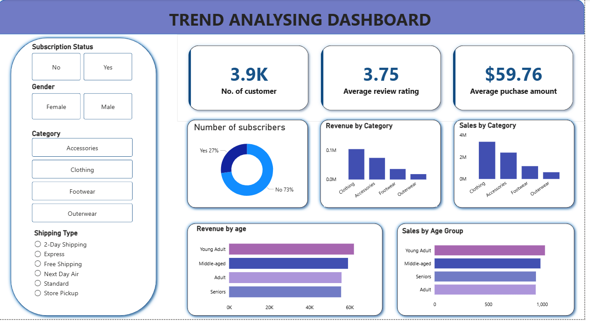

# 📊 Customer Trend Analysis using PostgreSQL, Jupyter & Power BI

## 📌 Project Overview
This project focuses on **analyzing customer trends using SQL, Python, and Power BI**.  
The workflow involves storing customer data in a **PostgreSQL database**, performing **data analysis in Jupyter Notebook**, and building an **interactive Power BI dashboard** for insights and visualization.

The goal of this project is to demonstrate **end-to-end data analytics**, from raw data to business-ready dashboards.

---

## 🧩 Project Components

- **Dataset** – Customer data stored in CSV format  
- **PostgreSQL** – Database for structured storage and querying  
- **SQL Queries** – Data extraction and transformation  
- **Jupyter Notebook** – Analysis and database connectivity  
- **Power BI** – Interactive dashboard for insights
- 

---

## 📁 Repository Structure

- `Customer_SQL_dataset.csv` – Customer dataset  
- `PostgreQuery.sql` – SQL queries for data analysis  
- `Trend.ipynb` – Jupyter Notebook (PostgreSQL connection & analysis)  
- `pwerBIReport.pbix` – Power BI dashboard  
- `README.md` – Project documentation  


---

## 🔧 Tools & Technologies Used

- **Database:** PostgreSQL  
- **Programming Language:** Python  
- **Libraries:** psycopg2, pandas, SQLAlchemy  
- **Notebook Environment:** Jupyter Notebook  
- **Visualization Tool:** Power BI  
- **Query Language:** SQL  

---

## 🔄 Project Workflow

1. **Data Source**
   - Customer data provided in CSV format (`Customer_SQL_dataset.csv`).

2. **Database Setup**
   - Data imported into PostgreSQL.
   - SQL queries written for analysis and trend extraction.

3. **Data Analysis (Jupyter Notebook)**
   - PostgreSQL connected to Jupyter Notebook.
   - SQL queries executed using Python.
   - Data analyzed using pandas.

4. **Data Visualization (Power BI)**
   - Power BI dashboard created using processed data.
   - Interactive visuals for trend analysis and insights.

---

## 📊 Power BI Dashboard Highlights

- Customer trend analysis  
- Aggregated metrics and summaries  
- Interactive filters for deeper insights  
- Clean and business-oriented visual design

  

---

## 🚀 How to Run This Project

### 1️⃣ Setup PostgreSQL
- Create a PostgreSQL database.
- Import `Customer_SQL_dataset.csv` into a table.

### 2️⃣ Execute SQL Queries
- Run queries from `PostgreQuery.sql` in PostgreSQL.

### 3️⃣ Run the Jupyter Notebook
```bash
jupyter notebook


